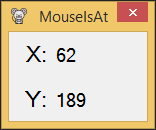

Getting Started With MouseIsAt
===================================

MouseIsAt is a simple windows form application which shows the current position of the cursor on the screen.

## ScreenShot

### Dependencies
.NetFrameWork 4.5